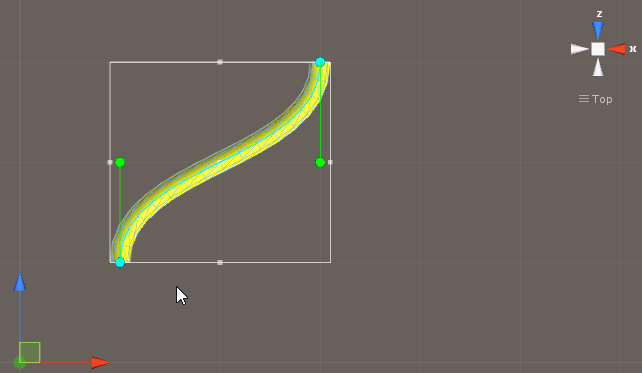
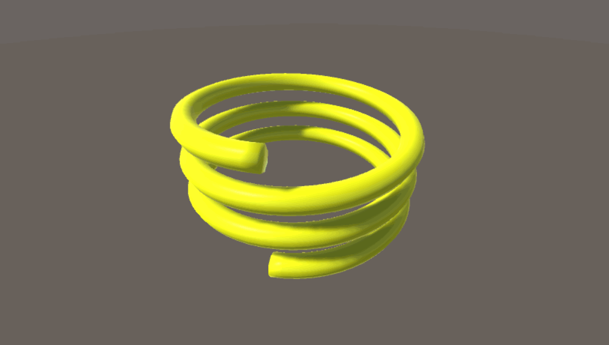
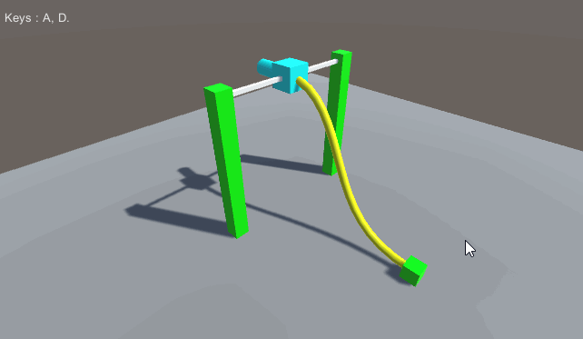

# MGS-FlexiblePipe
- [中文手册](./README_ZH.md)

## Summary
- Unity plugin for create flexible pipe in scene.

## Demand
- Create flexible pipe base on bezier curve.
- Create flexible pipe base on anchor curve.

## Environment
- Unity 5.0 or above.
- .Net Framework 3.0 or above.

## Achieve
- BezierCurve : Define bezier curve.

- HermiteCurve : Hermite curve in three dimensional space.

- EllipseCurve : Ellipse curve.

- HelixCurve : Helix curve.

- SinCurve : Sin curve.

- Skin : Define Skin to render dynamic mesh.

- CurvePipe : Define CurvePipe to render dynamic pipe mesh base on
  center curve.

- BezierPipe : Render dynamic pipe mesh base on cubic bezier curve.

- AnchorPipe : Render dynamic pipe mesh base on anchor vector animation
  curve.

- CirclePipe : Render dynamic pipe mesh base on circle curve.

- EllipsePipe : Render dynamic pipe mesh base on ellipse curve.

- HelixPipe : Render dynamic pipe mesh base on helix curve.

- SinPipe : Render dynamic pipe mesh base on sin curve.

- Machine : Machine cable example.

- HelpUI : Draw help info in scene.

## Demo
- Demos in the path "MGS-FlexiblePipe/Scenes" provide reference to you.

## Preview
- Bezier Pipe Editor

- Anchor Pipe Editor

- Circle Pipe

- Ellipse Pipe

- Sin Pipe

- Helix Pipe

- Machine Cable

## Contact
- If you have any questions, feel free to contact me at mogoson@outlook.com.