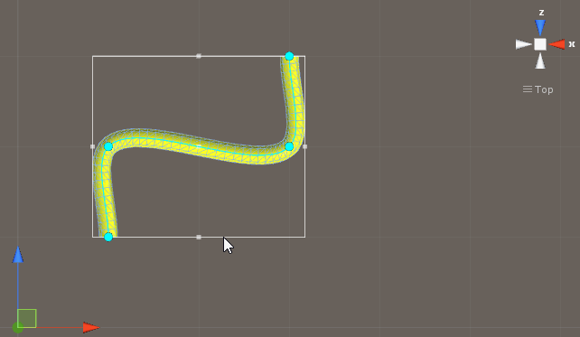

# MGS-SkinnedMesh

- [Alibaba Cloud](https://www.aliyun.com/minisite/goods?userCode=0fgf4qk9)

## Summary
- Unity plugin for create skinned mesh in scene.

## Demand

### CurveHose

- Create flexible hose base on bezier curve.
- Create flexible hose base on anchor curve.

## Environment
- Unity 5.0 or above.
- .Net Framework 3.5 or above.

## Achieve

### CurveHose

- BezierCurve : Define bezier curve.

- HermiteCurve : Hermite curve in three dimensional space.

- EllipseCurve : Ellipse curve.

- HelixCurve : Helix curve.

- SinCurve : Sin curve.

- CurveHose : Define CurveHose to render dynamic hose mesh base on
  center curve.

- BezierHose : Render dynamic hose mesh base on cubic bezier curve.

- HermiteHose : Render dynamic hose mesh base on anchor vector animation
  curve.

- CircleHose : Render dynamic hose mesh base on circle curve.

- EllipseHose : Render dynamic hose mesh base on ellipse curve.

- HelixHose : Render dynamic hose mesh base on helix curve.

- SinHose : Render dynamic hose mesh base on sin curve.

## Demo
- Demos in the path "MGS-SkinnedMesh/Scenes" provide reference to you.

## Preview

### CurveHose

- Bezier Hose Editor

- Hermite Hose Editor

- Circle Hose

- Ellipse Hose

- Sin Hose

- Helix Hose

- Machine Cable

## Contact
- If you have any questions, feel free to contact me at mogoson@outlook.com.