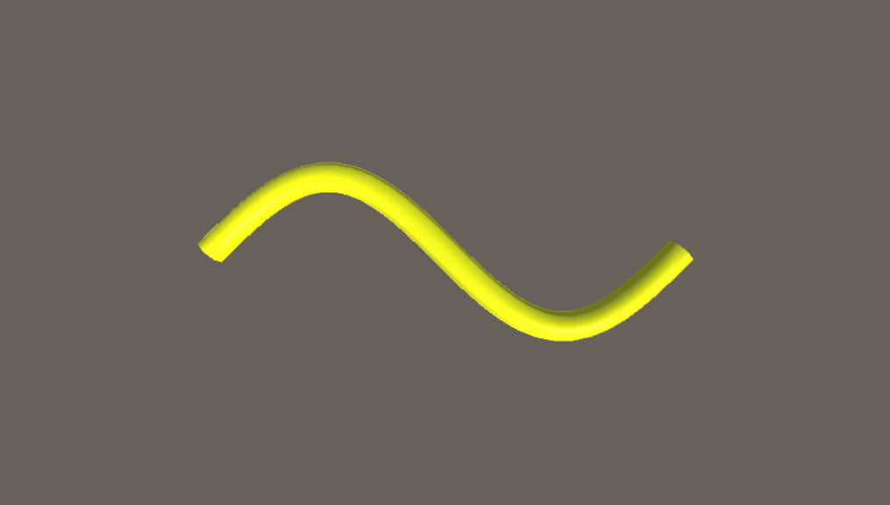

# MGS-CurveHose
- [English Manual](./README.md)

## 概述
- Unity场景中制作软管插件包。

## 需求
- 基于贝塞尔曲线创建软管。
- 锚点曲线创建软管。

## 环境
- Unity 5.0 或更高版本。
- .Net Framework 3.5 或更高版本。

## 实现
- BezierCurve : 贝塞尔曲线。

- HermiteCurve : 分段三次埃尔米特曲线。

- EllipseCurve : 椭圆曲线。

- HelixCurve : 螺旋曲线。

- SinCurve : Sin曲线。

- CurveHose : 基于曲线创建动态软管。

- BezierHose : 基于贝塞尔曲线创建动态软管。

- HermiteHose : 基于锚点曲线创建动态软管。

- CircleHose : 基于圆形曲线创建动态软管。

- EllipseHose : 基于椭圆曲线创建动态软管。

- HelixHose : 基于螺旋曲线创建动态软管。

- SinHose : 基于Sin曲线创建动态软管。

## 案例
- “MGS-CurveHose/Scenes”目录下存有上述功能的演示案例，供读者参考。

## 预览
- Bezier Hose Editor

- Hermite Hose Editor

- Circle Hose

- Ellipse Hose

- Sin Hose

- Helix Hose

- Machine Cable

## 联系
- 如果你有任何问题或者建议，欢迎通过mogoson@outlook.com联系我。
